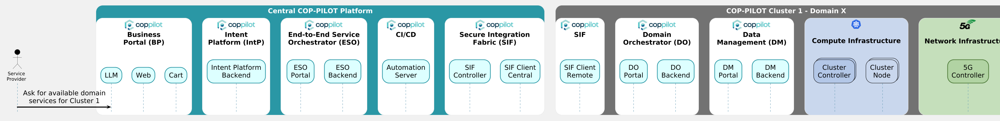

# COP-PILOT's common workflow UML library

This repository creates a UML library dedicated to [COP-PILOT](https://cop-pilot.eu/) and its main platform components.
The purpose of this library is to be used by all COP-PILOT stakeholders to design sequence diagrams that concern:
- Internal interactions among platform components
- Interactions between COP-PILOT stakeholders and the platform
- Interactions of the COP-PILOT platform and the various Cluster infrastructures.

To exploit this common UML library and design your desired workflow, please follow the steps below.

## Install VSCode with extensions
- Install [VSCode](https://code.visualstudio.com/)
- Install the following VSCode Extensions (Shift+Ctrl+X):
  - Markdown All in One (`yzhang.markdown-all-in-one`)
  - PlantUML (`jebbs.plantuml`)

## Configure VSCode
Go to File > Preferences > Settings:
- Select "User" tab to apply the settings to user-wide VSCode or "Workspace" tab to apply them to this workspace only.
  - Both options are valid; it depends if you want to inherit these settings in other workspaces.
- Find the following settings using the search box and apply the values indicated:
  - `plantuml.server` : `https://www.plantuml.com/plantuml`
  - `plantuml.render` : `PlantUMLServer`

## Cluster workflows

If you work for one of the COP-PILOT clusters, go to the respective `clusters/cl<number>` folder.

In this folder you need to design Cluster and use-case-specific components following [this](clusters/cl1/components-cl1-uc1.puml) example.

Once your UC-specific components are in place, then you may design your cluster workflow following [this](clusters/cl1/cop-pilot-wf-cl1-uc1.md) example.

This latter Markdown file imports both the central COP-PILOT components defined [here](templates/components-central.puml) as well as your Cluster and UC-specific components designed for a given scenario (e.g., [cl1-uc1](clusters/cl1/components-cl1-uc1.puml) in this case) to create the end-to-end COP-PILOT ecosystem for this specific scenario.

Any other COP-PILOT UC should follow the same approach, inheriting the central components from the template and extending the workflow with UC specific components according to your scenario.

## Platform workflows

For those partners wishing to design Platform-related workflows, go to the [platform](./platform) folder.
An example workflow shows how components of the central platform interact to realize peering between the ESO and a local DO, both in the same domain.

## Preview a Markdown file in VSCode

Open the example workflow file, e.g., [cop-pilot-wf-cl1-uc1](clusters/cl1/cop-pilot-wf-cl1-uc1.md).

Right click on it and click `Open Preview` or press `Shift+Ctrl+V`.

Shortly you will get the rendered Markdown page with the rendered diagram figure as below:

You can extend this example or generate a similar file with your preferred workflow.
